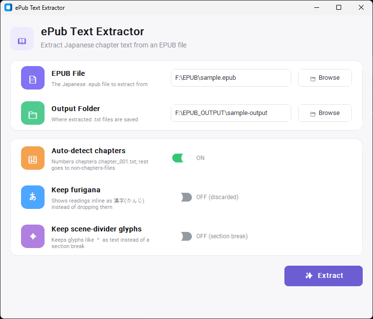
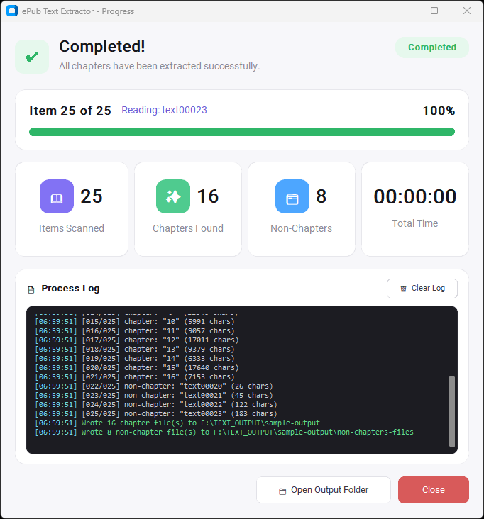

# ePub Text Extractor

Extracts chapter text from Japanese EPUB files, with proper handling of
furigana (ruby text — the small hiragana readings printed above/next to
kanji in Japanese ebooks). 

This tool is optimized to generate text files for audiobook generation tool on my other repo.
Please take a look at [JP-Audiobook-Generator](https://github.com/hermanismail/JP-Audiobook-Generator)

> **⚠️ Disclaimer:** Only use this tool on EPUB files you have the legal
> right to extract text from — for example, books you've purchased for
> personal use, public-domain works, or your own writing. Extracted text
> is still subject to copyright even after it's converted to `.txt`.
> Redistributing or publishing extracted text from a copyrighted book
> without permission from the rights holder can create legal liability
> for you. This project does not include, host, or distribute any book
> content — it is a text-processing tool only, and responsibility for
> how it's used with any given EPUB rests with the person running it.

## Setup (one-time)

Run below scripts on your working folder. Worth checking the requirements.txt beforehand to prevent unecessary install.

```powershell
cd C:\ePub-Text-Extractor
python -m venv venv
.\venv\Scripts\Activate.ps1
pip install -r requirements.txt
```

`requirements.txt` includes `customtkinter`, used by the GUI
(`epub_extractor_gui.py`). If you only ever use the command line, it's
harmless to have installed but not required to run `epub_extractor.py`
directly.

## GUI (recommended)

```powershell
cd C:\ePub-Text-Extractor
.\venv\Scripts\Activate.ps1
python epub_extractor_gui.py
```

This opens settings/progress
windows.

### Settings screen



The top section picks the input/output paths; the panel below controls
how extraction behaves.

| Field / control | What it does |
| --- | --- |
| **EPUB File** | Path to the Japanese `.epub` file to extract from. Use **Browse** to pick it with a file dialog. |
| **Output Folder** | Where the extracted `.txt` files are saved. Defaults to an `output` folder next to the epub once a file is picked; **Browse** lets you pick or create a different folder. |
| **Auto-detect chapters** | **ON** by default. Splits spine items into real chapters (numbered `chapter_001.txt`, `chapter_002.txt`, ... directly in the output folder) vs. everything else (title pages, colophons, afterwords — sent to `non-chapters-files\`). See "Chapter detection" below for the rules. Turning this **OFF** falls back to the flat mode — every item gets its own numbered file, no chapter/non-chapter split. |
| **Keep furigana** | **OFF** by default, meaning furigana (ruby readings) are discarded and only the base kanji/text is kept. Turn **ON** to keep the reading inline instead, rendered as 漢字(かんじ). |
| **Keep scene-divider glyphs** | **OFF** by default, meaning a typographic scene-divider glyph (e.g. a centered ＊) is dropped from the text and turned into a section break (blank line) instead — so it isn't read aloud by a downstream TTS engine. Turn **ON** to keep the glyph as literal text rather than converting it to a section break. |
| **Extract** | Starts extraction and opens the progress window below. |

### Progress / completion screen



| Element | What it shows |
| --- | --- |
| Status banner (✓ **Completed** / in-progress / failed) | Overall run status, with a short one-line summary underneath. |
| Progress bar | Live position — "Item *N* of *Total*", the current item being read (e.g. `Reading: text00023`), and percent complete. |
| **Items Scanned** | Total spine items read from the epub. |
| **Chapters Found** | How many of those were classified as real chapters (written as `chapter_NNN.txt`). |
| **Non-Chapters** | How many were classified as front/back matter etc. (written to `non-chapters-files\`). |
| **Total Time** | Wall-clock time the extraction run took. |
| **Process Log** | Scrolling, timestamped log of each item as it's processed — shows whether each was classified as a chapter or non-chapter, its detected title, and character count. **Clear Log** clears this panel (doesn't affect output files). |
| **Open Output Folder** | Opens the output folder (from the Settings screen) in File Explorer. |
| **Close** | Closes the progress window. |

## Command line

Activate the virtual environment first (if not already active):

```powershell
cd C:\ePub-Text-Extractor
.\venv\Scripts\Activate.ps1
```

Then run:

```powershell
# Chapter detection on by default: chapter_001.txt, chapter_002.txt, ...
# in the output folder; everything else goes into non-chapters-files\
python epub_extractor.py "C:\path\to\book.epub" -o output

# Keep furigana inline, e.g. 漢字(かんじ)
python epub_extractor.py "C:\path\to\book.epub" -o output --keep-furigana

# One combined .txt file for the whole book instead of per-chapter files
# (chapter detection doesn't apply in this mode)
python epub_extractor.py "C:\path\to\book.epub" -o output --single-file

# Keep typographic scene-divider glyphs (e.g. a lone ＊) as literal text
# instead of converting them to a section break
python epub_extractor.py "C:\path\to\book.epub" -o output --keep-scene-markers

# Old flat behavior: every item as its own numbered file, no chapter
# detection / no non-chapters-files split
python epub_extractor.py "C:\path\to\book.epub" -o output --flat
```

## Chapter detection

By default (GUI: "Auto-detect chapters" ON; CLI: no `--flat` flag), each
EPUB spine item is classified as a real chapter or not, based on its
detected title (the first `<h1>`/`<h2>`/`<h3>`/`<title>` found in that
item's HTML):

- **Chapters** are renumbered in reading order and written directly in
  the output folder as `chapter_001.txt`, `chapter_002.txt`, etc. — this
  matches the `chapter_*.txt` naming `JP-Audiobook-Generator`'s
  `run_audiobook.py` expects to find in its input folder, so the output
  folder here can be pointed at directly as that pipeline's input.
- **Everything else** (title pages, publisher's notes, colophons,
  translator's afterwords, etc.) is written into a `non-chapters-files`
  subfolder, keeping the original `NNN_Title.txt` numbering so it's easy
  to trace back to its position in the book.

The classification rule (`CHAPTER_TITLE_PATTERNS` /
`is_chapter_title()` in `epub_extractor.py`) currently matches titles
that are:

- a bare number, half- or full-width (`1`, `16`, `１`) — this is the
  convention the sample book uses for every chapter
- `第...章` / `第...話` / `第...部` / `第...編` (e.g. 第一章, 第3話)
- `Chapter N` (romaji headers, seen in some epubs)

This is a **rough, rule-based first pass, not a perfect classifier** — by
design, since every book's epub is a little different and it's meant to
be verified by eye each run rather than trusted blindly. If it
misclassifies a book:

1. Check the `non-chapters-files` subfolder — a real chapter that got
   missed will be sitting in there under its original `NNN_Title.txt`
   name.
2. Add a pattern to `CHAPTER_TITLE_PATTERNS` (or loosen an existing one)
   to match that book's chapter-heading convention, and re-run.
3. Or turn off "Auto-detect chapters" (GUI) / pass `--flat` (CLI) to skip
   classification entirely and get the old flat, numbered-per-item output.

## Paragraph / section structure

Output is compatible with `JP-Audiobook-Generator`'s convention (see its
README §7.1): a normal paragraph break is written as a single line break,
and a blank line (2+ line breaks in a row) marks a **section** break.

Two things in the source EPUB become a section break:

- A blank "spacer" paragraph — Japanese ebook typesetting commonly inserts
  an empty `<p><br/></p>` between paragraphs for extra visual breathing
  room. Where the source has one, the output gets a blank line instead of
  just a normal paragraph break.
- A paragraph that's just a typographic scene-divider glyph (e.g. a
  centered "＊", "※", "○", or a run of dashes) — dropped from the text
  (so it isn't read aloud by a TTS engine) and turned into a blank line.
  Pass `--keep-scene-markers` / toggle "Keep scene-divider glyphs" in the
  GUI to keep the glyph as literal text instead.

Files are written with Python's normal text-mode `open(..., "w")`, so on
Windows a `\n` in the code becomes a real CRLF (`\r\n`) on disk — no extra
handling needed for that part.

## Notes / known limitations

- Chapter titles are pulled from the first `<h1>`/`<h2>`/`<h3>`/`<title>`
  found in each spine item. If a book doesn't mark titles this way, files
  fall back to a numbered name based on the internal file name (and won't
  match the chapter-detection patterns, so they land in
  `non-chapters-files`).
- Ruby spanning multiple kanji with irregular groupings (common in some
  Japanese typesetting) is handled on a best-effort basis — the base text
  inside each `<ruby>` tag is kept in full; only the `<rt>` reading is
  stripped or parenthesized.
- Vertical-text-only or heavily illustrated EPUBs (some manga/light-novel
  editions) may have little or no extractable text if the "text" is
  actually embedded as images.
- If a chapter comes out empty or garbled, send the `.epub` back and we
  can inspect its internal HTML structure and adjust the parser.
- Scene-divider detection (`_SCENE_BREAK_RE` in the script) only matches
  short runs of common divider characters (＊, *, ・, ○, ●, ◎, □, ■, ▽,
  △, ◇, ☆, ★, †, ‡, ~, 〜, -, －, ー). A book using a different divider
  convention would need that pattern extended, or run with
  `--keep-scene-markers` and handle it downstream instead.
- Chapter detection (`CHAPTER_TITLE_PATTERNS`) only matches a few common
  numbering conventions for now — see "Chapter detection" above for how
  to extend it as new book formats come up.

